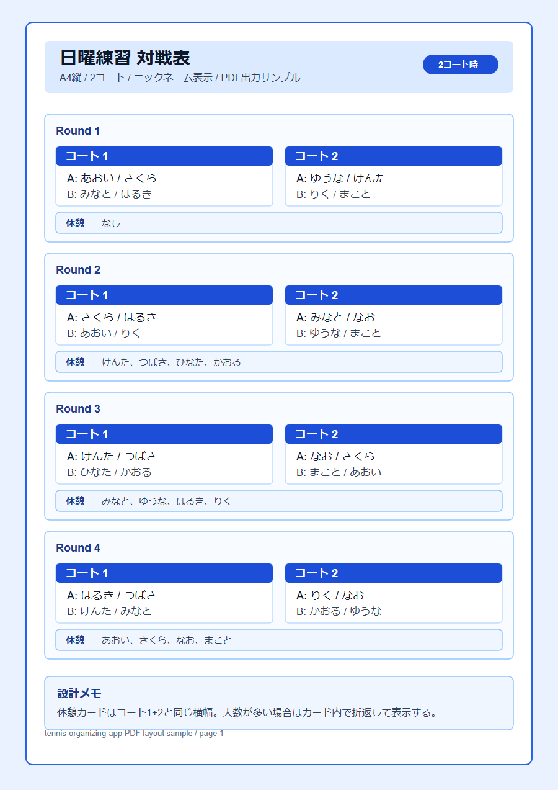
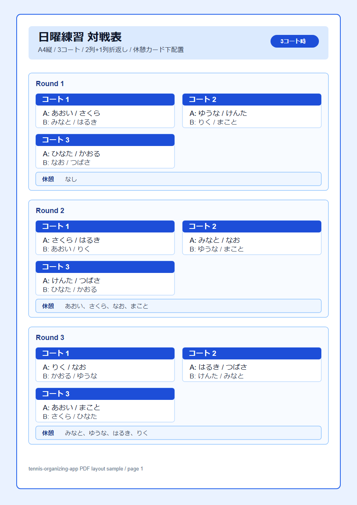

# tennis-organizing-app 要件分析・設計方針

作成日: 2026-05-08

## 1. 目的

`tennis-organizing-app` は、テニス練習会向けに以下を提供する。

- ログインユーザーごとのメンバー管理
- 登録メンバーからの参加者選択
- `tennis-matchup-app` API を利用した対戦表作成
- ニックネーム表示のPDF出力
- Guest向けの人数手入力による簡易対戦表作成

技術スタックと設計方針は、既存の `tennis-matchup-app` を踏襲する。対戦組合せロジックは本アプリでは再実装せず、`../tennis-matchup-app/docs/api-design.md` の API をサーバー側から呼び出す。

## 2. 確定要件

### 2.1 認証

- Firebase Authentication を利用する。
- メールアドレス + パスワードによる登録・ログインを提供する。
- Guest は Firebase 匿名認証でログイン可能とする。
- FirebaseUI は利用せず、アプリ独自のログインUIを実装する。
- Guest はメンバー管理、登録メンバーからのメンバー選択、PDF出力を利用できない。

認証画面遷移:

- ID未登録時: ログイン画面 -> 新規登録ボタン -> パスワード設定画面 -> OKボタン -> ログイン画面。
- パスワード設定画面では、メールアドレスとパスワード2回入力により Firebase Authentication へID登録する。
- ID登録後は自動ログイン状態でホームへ進めず、ログイン画面へ戻して明示的にログインする。
- ID登録済時: ログイン画面 -> メールアドレス、パスワード入力 -> ログインボタン -> ホーム画面。
- ID登録済みだがパスワード不一致でログインできない場合は、ログイン画面からパスワード再設定メールを送信できるようにする。
- Guestログイン時もホーム画面へ遷移するが、ホーム画面上のメンバー登録ボタンは無効化する。

ホーム画面方針:

- ホーム画面は `tennis-matchup-app` の条件入力画面に近い構成とし、対戦モード、開催名、人数、コート数、実施回数を主要入力として配置する。
- ログインユーザーのホーム画面には `メンバー登録` ボタンを表示し、押下するとメンバー登録画面へ遷移する。
- ログイン後のヘッダーにはログインIDを表示し、表示位置は `ログアウト` ボタンの左側とする。メールログイン時はメールアドレス、Guest時は `Guest` を表示する。
- 登録メンバー数はホーム上部の `メンバー登録` ボタン付近へ表示する。
- 登録メンバーが1人以上いるログインユーザーでは、条件入力エリアに `メンバー選択` ボタンを配置し、押下時にプルダウン形式の参加者選択リストを表示する。
- プルダウン内のチェック状態は仮選択とし、`OK` 押下でホーム画面の選択状態へ確定する。`キャンセル` 押下時は変更を破棄する。
- プルダウン見出しは `参加メンバー選択（最大30人）` とし、選択数表示は `選択数 / 登録数` とする。
- 参加メンバー選択プルダウンには `全選択` と `選択解除` を配置する。`全選択` は現在の並び順で登録メンバー全員を仮選択する。
- 参加メンバー選択は `OK` 押下時に最大30人の上限を検証し、30人を超えている場合はフッター操作行の `キャンセル` ボタン左側に短い赤文字エラーを表示して確定しない。
- 参加メンバー選択のメンバーカードは1列表示とし、チェックボックスはカード右側へ配置する。カード幅とドロップダウン幅は余白が出すぎないよう抑え、リスト内では6件程度を同時に確認できる高さを確保する。スマホ幅でもプルダウンは下の入力欄を押し下げず、重ねて表示する。
- `対戦表作成` ボタンは、参加者数4-30人、コート数1-8、実施回数1-20の条件を満たす場合のみ有効化する。
- `対戦表作成` ボタンは `SUMMARY` カードの右端に配置し、スマホ幅では `SUMMARY` の下側に横幅いっぱいで配置する。
- `対戦表作成` ボタン押下時は、`tennis-organizing-app` のサーバー側API routeを経由して `tennis-matchup-app` API を呼び出し、生成結果をホーム画面下部に表示する。
- 入力されたコート数が参加人数に対して過剰な場合は、`floor(参加者数 / 4)` を上限に使用コート数を減らして対戦表を作成する。`SUMMARY` のコート数も減らした後の使用コート数を表示する。
- コート数を減らして作成する場合は、`対戦表作成` ボタン押下時に確認ダイアログを表示する。ダイアログには `コート数：○○面で対戦表を作成します。` を表示し、○○面は太字にする。`OK` で作成、`キャンセル` で作成を中止する。
- メンバー登録画面には、登録・編集フォームとメンバー一覧を同一画面内に表示する。
- Guest のホーム画面にも `メンバー登録` ボタンは表示するが、無効化して制限理由を表示する。
- Guest の条件入力行もログインユーザーと同じ構成にし、`メンバー選択` ボタン押下時はメンバー一覧の代わりに女性人数・男性人数の入力プルダウンを表示する。
- Guest の人数入力プルダウンは仮入力とし、`OK` 押下でホーム画面の参加人数・男女別人数へ確定する。`キャンセル` 押下時は変更を破棄する。

独自UIとする理由:

- ブルー系の画面デザインへ統一しやすい。
- 入力エラー、フォーカス順、ボタン配置、説明文の出し方を制御しやすい。
- React / Next.js の画面構成に合わせて、アクセシビリティ要件を満たしやすい。

参照:

- Firebase Password Authentication: https://firebase.google.com/docs/auth/web/password-auth
- Firebase Anonymous Authentication: https://firebase.google.com/docs/auth/web/anonymous-auth

### 2.2 データ保存

- メンバー情報は Cloud Firestore に保存する。
- データはログインユーザー単位で分離する。
- Guest のメンバー情報は保存しない。
- メンバー削除は物理削除ではなく、DB上は残して画面表示から除外する。
- メンバー情報は後から修正可能とする。

参照:

- Cloud Firestore Security Rules: https://firebase.google.com/docs/firestore/security/get-started

### 2.3 メンバー管理

- メンバー登録上限はログインユーザーごとに最大99人。
- メンバー項目:
  - ニックネーム: 必須。最大全角5文字分程度。
  - 氏名: 任意。
  - 性別: 必須。
  - 備考: 任意。
  - 並び順用かな: 画面入力項目としては表示しない。ニックネームから内部的に自動生成する。
  - 状態: `active` / `inactive`。
- 画面上の削除操作は `inactive` への更新とし、一覧・参加者選択から除外する。
- 編集時は既存IDを維持し、対戦表作成用の参加者IDとして安定利用できるようにする。

### 2.4 メンバー選択

- 対戦表作成時、登録済み `active` メンバーから参加者を選択する。
- 参加者数の上限は最大30人。
- 参加者数が4人未満の場合は対戦表作成不可とする。
- リストの並び順は以下を切り替え可能とする。
  - 登録順（新しい登録が先）
  - アイウエオ順
- 選択されたメンバーから男女別人数を自動集計する。
- Guest は登録メンバーからの選択は使えず、`メンバー選択` ボタンから女性人数・男性人数を手入力する。

上限30人の根拠:

- `tennis-matchup-app` API の参加人数上限が30人であるため。
- 登録メンバー99人と、対戦表作成時の参加者30人は別制約として扱う。

### 2.5 対戦表作成

`tennis-matchup-app` API の通常生成 API を利用する。

- API: `POST /api/v1/matchups/generate`
- 呼び出しは `tennis-organizing-app` のサーバー側 route から行う。
- ブラウザへ `MATCHUP_API_KEY` を出さない。
- APIキーは環境変数で管理する。
- 対戦モードのデフォルトは `通常` とする。

対戦モード:

| 画面表示 | API値 | 概要 |
| --- | --- | --- |
| 通常 | `standard` | 性別優先なし |
| 同性対決優先 | `sameGenderPriority` | 同性対決を優先 |
| 混合対決優先 | `mixedDoublesPriority` | 混合対決を優先 |

API送信方針:

- 通常ユーザーの場合:
  - `participants[].id`: メンバーID
  - `participants[].name`: ニックネーム
  - `participants[].gender`: 対戦モードが `standard` 以外の場合に必須
- Guestの場合:
  - メンバー情報を使わない。
  - 人数分の番号表示名を生成する。例: `1`, `2`, `3`
  - 画面上の対戦表結果は番号表示で余白が出やすいため、`tennis-matchup-app` に合わせて左側にコートカードの横スクロール領域、右端に休憩カードを固定配置する。
  - Guestのコートカードは最大4コート分を同時表示可能とし、4コートを超える場合はコートカード領域のみ横スクロール表示にする。
  - Guest ではPDF出力不可。

API制約:

- 参加人数: 4-30
- コート数: 1-8
- 回数: 1-20
- 対戦モード未指定時は `standard`
- `sameGenderPriority` / `mixedDoublesPriority` では `participants[].gender` が必要

参照:

- `../tennis-matchup-app/docs/api-design.md`

### 2.6 PDF出力

- PDFはログインユーザーのみ利用可能とする。
- Guest はPDF出力不可。
- PDF向きは A4縦とする。
- 表示名はニックネームとする。
- 配色はブルー系で統一する。
- 休憩者が多い場合に備え、休憩表示は独立カードにする。

PDFレイアウト方針:

- PDF本文は `R | A | B | A | B` の固定列を基本とし、1行あたり最大2コートを表示する。
- 各コートはコート名行を `A` / `B` の2列分で結合し、その下にAペア・Bペアを別列で表示する。
- Aペア・Bペアのニックネームはカンマ区切りではなく、1名ずつ2行で表示する。
- 3コート以上の場合は、同一ラウンド内で2コート単位に折り返す。
- A4縦1ページに3コート時4ラウンド程度、4コート時5ラウンド程度が収まるよう、ペア表示行の高さとラウンド間隔を抑える。
- 罫線はブルー系で統一し、PDF上で読みやすい細線を使用する。ラウンド間には罫線なしの余白を設け、外枠が連続して見えないようにする。

| コート数 | レイアウト |
| --- | --- |
| 1コート | コート1カード + 休憩カード |
| 2コート | コート1・2を横並び + 下に休憩カード |
| 3コート | コート1・2を横並び、コート3を次行左側 + 下に休憩カード |
| 4コート以上 | 2コート単位で折返し + 最下部に休憩カード |

休憩カード:

- コート1 + コート2 の合計幅と同じ横幅にする。
- コートカード群の下側へ配置する。
- 休憩者が多い場合はカード内で折返す。
- 休憩者なしの場合は `なし` と表示する。

サンプル:





元データ:

- `docs/pdf-layout-portrait-2-courts.svg`
- `docs/pdf-layout-portrait-3-courts.svg`

## 3. 画面・アクセシビリティ方針

### 3.1 色

- 画面系の表示色はブルー系で統一する。
- 背景は白または薄いブルーを基本とする。
- 主操作ボタンは濃いブルー、補助操作は白背景 + ブルー枠とする。
- エラーは赤系を使うが、色だけに依存せず文言とアイコンも併用する。

### 3.2 フォント・サイズ

- 本文と入力欄は 16px 以上を基準にする。
- ボタンのタップ領域は 44px 以上を確保する。
- PDF本文も可読性を優先し、ニックネームが詰まりすぎない文字サイズにする。
- 長い文字列は切り捨てではなく、可能な箇所では折返しを優先する。

### 3.3 操作

- 主要操作は画面下部またはフォーム末尾に明確に配置する。
- キーボード操作でログイン、メンバー登録、参加者選択、対戦表作成まで到達できるようにする。
- フォーカスリングを視認できるようにする。
- Guestで利用できない機能は、単に非表示にするだけでなく、導線上で制限理由を理解できる表示にする。

## 4. データ設計案

### 4.1 Firestore構成

```txt
users/{uid}
  profile
    displayName
    createdAt
    updatedAt

users/{uid}/members/{memberId}
  nickname
  fullName
  gender
  note
  sortKeyKana
  status
  displayOrder
  createdAt
  updatedAt
  deactivatedAt
```

### 4.2 メンバー

```ts
type Member = {
  id: string;
  nickname: string;
  fullName?: string;
  gender: "female" | "male";
  note?: string;
  sortKeyKana?: string;
  status: "active" | "inactive";
  displayOrder: number;
  createdAt: string;
  updatedAt: string;
  deactivatedAt?: string;
};
```

設計意図:

- `id` はAPI送信用の参加者IDにも使うため、編集しても変えない。
- `status` により、画面から消しつつDB上に履歴を残す。
- `displayOrder` により登録順を安定して再現する。画面表示では新しい登録が先になる降順を基本とする。
- `sortKeyKana` によりアイウエオ順の期待差異を減らす。画面には表示せず、ニックネームから辞書ベースの読み推定と正規化により自動設定する。

## 5. アプリ構成案

### 5.1 主な画面

| 画面 | Guest | ログインユーザー | 概要 |
| --- | --- | --- | --- |
| ログイン | 可 | 可 | メール/パスワード、Guestログイン |
| パスワード設定 | 可 | 可 | 新規ID登録用のパスワード2回入力 |
| ホーム | 可 | 可 | 主要機能への入口。Guestでは制限付き |
| メンバー一覧 | 不可 | 可 | activeメンバー一覧、編集、無効化 |
| メンバー登録/編集 | 不可 | 可 | メンバー追加・修正 |
| 参加者選択 | 不可 | 可 | activeメンバーから最大30人を選択 |
| Guest条件入力 | 可 | 不可 | 人数、コート数、回数、対戦モード入力 |
| 対戦表結果 | 可 | 可 | 組合せ結果表示 |
| PDF出力 | 不可 | 可 | ニックネーム表示PDF |

### 5.2 サーバー側API route

`tennis-organizing-app` 側にAPI proxy routeを置く。

```txt
src/app/api/matchups/generate/route.ts
```

責務:

- Firebaseログイン状態に応じた利用可否判定。
- 画面入力の検証。
- `MATCHUP_API_BASE_URL` と `MATCHUP_API_KEY` を使った `tennis-matchup-app` API 呼び出し。
- APIエラーを画面向けエラーへ変換。
- APIキーをブラウザに露出しない。

画面側:

- ログインユーザーは選択済みメンバーのID、ニックネーム、性別をAPIへ渡す。
- Guestは女性人数・男性人数から番号表示の参加者を生成し、APIへ渡す。
- API応答の `rounds` をラウンド別に表示し、各コートは `A` / `B` のペアで表示する。ログインユーザーでは休憩者をラウンド下部の休憩カードに表示し、Guestでは右端固定の休憩カードに表示する。

## 6. 優先度

### 致命

- 他ユーザーのメンバー情報を読める、または更新できる。
- APIキーがブラウザやログに露出する。
- 対戦表作成で入力条件と異なる参加者・人数が使われる。

### 重大

- Guest制限が崩れ、メンバー管理やPDF出力が使えてしまう。
- 31人以上を選択でき、APIエラーがユーザーに分かりにくくなる。
- PDFでニックネームや休憩者が読めない。
- 性別優先モードで `gender` が不足したままAPIを呼ぶ。

### 軽微

- アイウエオ順が一部期待と異なる。
- 備考欄の長文表示が一覧で見づらい。
- PDFの余白やページ内ラウンド数が微調整不足。

まず防ぐべき不具合:

- データ権限の崩れ。
- APIキー漏えい。
- 選択中の参加者と生成結果の不一致。
- Guest制限漏れ。
- PDFの文字切れ。

## 7. テスト設計

### 7.1 テスト観点一覧

機能観点:

- 認証、ログアウト、Guestログイン。
- メンバー登録、編集、無効化、一覧表示。
- 参加者選択、登録順（新しい順）/アイウエオ順のプルダウン切替、男女別人数集計。
- 対戦表作成、対戦モード指定、APIエラー表示。
- PDF出力、休憩カード表示。

非機能観点:

- Firestore Security Rules によるユーザー分離。
- APIキー秘匿。
- ネットワーク遅延、API 401/422/500。
- モバイル表示、キーボード操作、フォーカス表示。
- PDFの可読性、印刷時の余白、ページ分割。

データ観点:

- 登録メンバー数: 0、1、98、99、100。
- 参加者数: 0、3、4、30、31。
- ニックネーム: 空、全角5文字、長すぎる文字列、同名。
- 氏名・備考: 未入力、長文。
- 性別: male、female、未指定。
- 状態: active、inactive。

UI観点:

- 入力エラー表示。
- disabled状態の理由表示。
- ブルー系配色のコントラスト。
- タップ領域とボタン配置。
- PDFプレビューまたは出力結果での文字切れ。

### 7.2 正常系

| ID | 観点 | ケース | 意図 |
| --- | --- | --- | --- |
| N-001 | 認証 | メール/パスワードで登録・ログインできる | 基本認証が成立すること |
| N-002 | Guest | Guestログイン後、人数手入力で対戦表を作成できる | Guestの許可機能が使えること |
| N-003 | メンバー | 99人まで登録できる | 登録上限内の最大値を扱えること |
| N-004 | 編集 | 登録済みメンバーのニックネーム、氏名、性別、備考を修正できる | 後編集要件を満たすこと |
| N-005 | 無効化 | メンバーを無効化すると一覧と参加者選択から消える | 画面上の削除要件を満たすこと |
| N-006 | 選択 | activeメンバーから4-30人を選択できる | API上限内で参加者選択できること |
| N-007 | 並び順 | 登録順（新しい順）とアイウエオ順をプルダウンで切り替えられる | 選択リストの操作性を満たすこと |
| N-008 | モード | 通常、同性対決優先、混合対決優先で生成できる | 対戦モードがAPIへ反映されること |
| N-009 | PDF | 2コート時に横並びコート + 休憩カードで出力できる | 確定レイアウトを満たすこと |
| N-010 | PDF | 3コート時に2列+1列折返し + 休憩カードで出力できる | 確定レイアウトを満たすこと |

### 7.3 異常系

| ID | 観点 | ケース | 意図 |
| --- | --- | --- | --- |
| E-001 | 認証 | 誤ったパスワードでログイン失敗 | 認証エラーを適切に表示すること |
| E-002 | Guest | Guestでメンバー一覧へ遷移しようとする | 機能制限が破れないこと |
| E-003 | Guest | GuestでPDF出力しようとする | PDF制限が破れないこと |
| E-004 | メンバー | ニックネーム空で登録する | 必須入力を検証すること |
| E-005 | メンバー | 100人目を登録する | 登録上限を検出すること |
| E-006 | 選択 | 31人を選択する | API上限前に画面で止めること |
| E-007 | API | APIが401を返す | APIキー設定不備を切り分けられること |
| E-008 | API | APIが422を返す | 入力不備として画面表示できること |
| E-009 | API | APIが500またはタイムアウトする | 再試行可能な失敗として扱えること |
| E-010 | 性別 | 性別優先モードで性別未指定の参加者がいる | API呼び出し前に不足を検出すること |

### 7.4 境界値

| ID | 観点 | 値 | 意図 |
| --- | --- | --- | --- |
| B-001 | 参加者数 | 3人 | 作成不可の下限直下 |
| B-002 | 参加者数 | 4人 | 作成可能の下限 |
| B-003 | 参加者数 | 30人 | 作成可能の上限 |
| B-004 | 参加者数 | 31人 | 作成不可の上限超過 |
| B-005 | メンバー数 | 99人 | 登録可能の上限 |
| B-006 | メンバー数 | 100人 | 登録不可の上限超過 |
| B-007 | コート数 | 1、8、9 | API制約の境界 |
| B-008 | 回数 | 1、20、21 | API制約の境界 |
| B-009 | ニックネーム | 全角5文字相当、超過 | 表示幅と入力制限の境界 |

### 7.5 状態遷移

| ID | 状態遷移 | 意図 |
| --- | --- | --- |
| S-001 | 未ログイン -> メールログイン -> ホーム | 通常ユーザー導線が成立すること |
| S-002 | 未ログイン -> 新規登録 -> パスワード設定 -> ログイン画面 | ID未登録時の登録導線が成立すること |
| S-003 | 未ログイン -> メールログイン -> ホーム -> メンバー登録 | 通常ユーザーのホーム経由導線が成立すること |
| S-004 | 未ログイン -> Guestログイン -> ホーム | Guest導線が成立し、メンバー登録が無効であること |
| S-005 | active -> inactive | 無効化後に一覧・選択から除外されること |
| S-006 | inactive -> active | 将来復元する場合にデータが再利用できること |
| S-007 | メンバー選択 -> 条件変更 -> 生成 | 表示中の選択状態が生成条件に反映されること |
| S-008 | 生成結果 -> PDF出力 | 生成結果とPDF内容が一致すること |
| S-009 | API失敗 -> 条件修正 -> 再生成 | 失敗後に状態が壊れず再実行できること |

### 7.6 実行・証跡方針

- Firestore Emulator / Auth Emulator を使ったローカル自動テストを優先する。
- API route は `MATCHUP_API_BASE_URL` と `MATCHUP_API_KEY` をテスト用に差し替え可能にする。
- API失敗時はリクエスト本文全量をログに出さず、件数、コート数、回数、モード、エラーコードを記録する。
- PDFは生成物のスナップショットまたは画像化により、2コート/3コート/休憩者多数のレイアウトを確認する。
- 同一実機や同一ブラウザセッションに対して、状態を共有するE2Eを並列実行しない。

## 8. 今後の実装順序案

1. Next.jsアプリ土台、Firebase設定、環境変数整理。
2. 認証画面とGuest導線。
3. Firestoreのメンバー管理 CRUD と Security Rules。
4. 参加者選択と男女別人数集計。
5. `tennis-matchup-app` API proxy route と対戦表作成。
6. 結果表示。
7. PDF出力。
8. テスト整備とアクセシビリティ確認。

## 9. 未決・実装時確認事項

- ニックネームの「全角5文字分程度」を入力制限にするか、警告表示に留めるか。
- PDFで休憩者が非常に多い場合のカード高さ上限と改ページルール。
- Guestの生成結果を画面上で共有できるようにするか。
